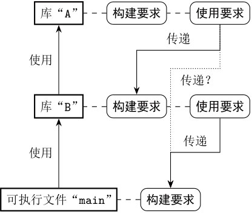

# 代码构建

## 目的

我们的希望是到恋爱可以“一次编写，到处编译”。

一次编写只需要尽量使用标准库和成熟的可移植性强的跨平台第三方库，尽量避免直接调用平台相关的API，转而使用条件编译等技巧。

而到处编译是一件麻烦的事情。
我们来整理一下到处编译的共通之处：

## 1. 构建的基本单元：源程序

如果不把头文件当作源程序，则可以说，源程序就是会被编译器编译成目标文件的文件。源程序可以看作构建过程中最基本的组成单元。
构建时，应当根据源程序所采用的编程语言，使用对应的编译器；同时，还要根据一些特殊的构建要求，确定编译时传递的参数，例如：

・头文件搜索目录；-I
・链接库文件搜索目录；-L, -l 或 '-Wl,-R$${ORIGIN}' （-L 用于指定链接时的库搜索目录， -l 用于指定要链接的库，而 -Wl,-R$${ORIGIN} 用于指定运行时的库搜索路径。）
・宏定义；
・其他编译链接参数等（如编译优化选项等）。

这些可以称为源程序的属性。构建系统会根据源程序的属性设定参数并调用编译器，从而正确生成目标文件。

## 2. 核心的抽象概念：构建目标

目标文件虽然名叫“目标”，但终究不是我们最终想要的目标。因此有构建目标（target，简称目标）这个概念。构建目标是建立在源程序之上的更高层抽象。当我们将一系列源程序组织成一个构建目标，就相当于为这些源程序指定了一些共同的编译和链接参数。

一般来说，我们会将一些目标文件打包或链接成库文件或可执行文件，这样这些库文件和可执行文件就可以称作构建目标了。当然，具体一点的话，它们是二进制构建目标（binary target）——多了个“二进制”的前缀。一是因为构建产生的库文件和可执行文件都是二进制文件，二是为了区分不产生二进制文件的构建目标，也就是后面会提到的伪构建目标（pseudo-target）。

### 2.1 二进制构建目标

二进制构建目标基本上包括以下类型：

・可执行文件；
・一般库（包含静态库和动态库）；
・目标文件库。

目标文件库（object library）是个新概念，但非常好理解——它就是目标文件的集合。它类似静态库，只不过省去了索引和打包的步骤。因此，构建目标文件库并不会产生一个库文件，而只是将其包含的源程序编译成目标文件。

我们引入这样一个概念同样是为了实现更灵活的代码复用。例如，当我们想复用源程序，但不愿产生额外的静态库文件时，就可以使用目标文件库。可以说，目标文件库并非是一个传统意义上的库，它更像是一个逻辑上的概念。但它毕竟包含一系列源程序，并指导编译器将它们编译为目标文件。也就是说，它终究还是产生了一系列二进制文件，所以我们仍将其看作二进制构建目标中的一种类型。

### 2.2 伪构建目标
在介绍构建目标时说过，伪构建目标不会产生二进制文件。那么，我们为什么还需要它呢？

还记得头文件库吗？头文件库本身不需要编译或链接，那么如果将它当作一个构建目标的话，不正是一种不会产生二进制文件的构建目标嘛！可是既然不需要构建，为什么还把它当作一个构建目标呢？这是一个好问题。目前为止，我们在理解构建目标时，总想着它是如何被构建的，但实际上构建目标这个抽象概念还有另一大作用，那就是声明它应当如何被使用。

以头文件库为例。如果利用构建目标抽象表示一个头文件库，那么其他程序在使用头文件库时，只需引用这个构建目标，并不需要知道头文件库具体的存储位置。可见，这个构建目标本身隐含了对使用者的要求：请在编译参数中指定头文件搜索目录为本目标代表的头文件库所在的目录。

将头文件库这种伪构建目标推广一下：自身不需要编译，但对使用者有一定要求的构建目标。这个推广后的伪构建目标称作接口库（interface library）。

当然，伪构建目标不止接口库这一种类型，它包含以下三种类型：

・接口库；
・导入目标；
・别名目标。

导入目标（imported target）一般用于抽象第三方库中的构建目标。第三方库要么是我们自己提前构建好的，要么是直接安装的预编译库，总之无须在使用它的时候再来构建。因此，导入目标尽管可能代表了某些二进制文件，但并不需要构建产生二进制文件，当然也是伪构建目标中的一种。与接口库类似，它自身无须编译，但对使用者提供了编译和链接的要求。

别名目标（alias target）就更加抽象了。顾名思义，它就是另一个构建目标的别名。既然是别名，也就没有必要再构建一次了，所以它同样是一种伪构建目标。别名目标通常用于隐藏实现细节。假设现在有一个自行构建的Boost库目标“boost”，一个预编译Boost库的导入目标“boost_prebuilt”，还有很多程序会链接Boost库。我们这时希望有一个开关能够切换这些程序是链接“boost”还是“boost_prebuilt”目标，那么可以创建一个别名目标“boost_alias”，根据设定作为“boost”或“boost_prebuilt”的别名。其他程序则无须关心设定，直接链接到“boost_alias”别名目标即可。

## 3.目标属性
前面提到源程序的属性可以用于确定调用的编译器及传递的参数，构建目标也应当拥有一些属性。对于伪构建目标而言，属性主要用于表示它应该被如何使用，即确定使用者的编译和链接参数；对于二进制构建目标来说，属性不仅用于表示它应该被如何使用，还用于确定自身源程序编译和链接时所需的参数。

### 3.1 构建要求和使用要求

与构建目标自身源程序相关的属性，确定了构建目标的构建要求（build specification）；而与其使用者相关的属性，则决定了构建目标的使用要求（usage requirements）。目标的使用要求，实际上会被传递到该目标使用者的构建要求中。正是这两种需求赋予了构建目标这个概念丰富的内涵，使其称为最核心的抽象概念。

构建要求和使用要求的区别在于要求所作用的对象，其要求本身并无区别——这也很好理解，毕竟这要求最终体现在源程序的编译和链接上，不论作用于谁，这一点都不会有变化。因此，常见的要求也就是之前提到的那些：

・头文件搜索目录；
・链接库文件搜索目录；
・宏定义；
・其他编译链接参数等。

下面以构建动态库为例，带领大家大致感受一下构建要求和使用要求，二者之间又有何种联系。
在Linux中构建动态库的Makefile。这里关注最后两条规则
```
liba.so: a.o
    gcc -shared a.o -o liba.so

a.o: a.c
    gcc -fPIC -c .a.c -o a.o
```
这两条规则实际上声明了动态库liba.so这个构建目标的构建要求：使用-fPIC参数编译构建目标的源程序a.c到目标文件a.o，使用-shared参数将目标文件链接成最终的动态库。

再来看第一条构建主程序的规则
```
main: main.o liba.so
    gcc main.o -o main -L. -la
 
main.o: main.c
    gcc -c main.c -o main.o
```
主程序的构建要求包括在链接过程中通过-L.参数指定链接库搜索目录，并通过-la参数指定链接库的名称。这同时也是动态库构建目标的使用要求。正如图所示，动态库的使用要求会传递到主程序的构建要求中。


其他二进制构建目标类型（如静态库、可执行文件）与之类似，但伪构建目标会有些不同，因为它们不需要被构建，自然也就不存在对应的构建要求，而只存在使用要求。

## 4. 使用要求的传递性

上面说明了构建要求和使用要求之间存在一定的传递性，从而使得构建目标这个抽象概念变得十分实用。本小节将继续深入探索有关传递性的问题。首先请思考以下问题。

如图所示，如果一个库A被另一个库B链接，那么很显然，库A的使用要求应当传递到库B的构建要求中；如果库 B又被可执行文件main链接，那么同样地，库B的使用要求也应当传递到main的构建要求中。以上陈述都没有什么问题，那么问题来了：库A的使用要求是否也应传递到main的构建要求中呢？

对于这个问题，我们先建立一个共识：如果可执行文件main本身使用了库A，那么库A的使用要求肯定应该传递给main的构建要求。这样一来，问题就变成了：main怎样才算使用了库A？一定是引用了库所对应的头文件，并调用了其中的函数或类吗？

当然未必。比如库B中的某个函数可能会返回一个在库A中定义的类型，main又调用了库B中的该函数，这就意味着main间接使用了库A。具体来说，main一定是引用了库B的某个头文件才能调用其中的函数，而这个库B的头文件又一定直接或间接地引用了库A中的头文件，否则它返回的库A中定义的类型就是未定义类型了。

既然main间接地引用了库A的头文件，也就意味着main应该根据库A的使用要求来链接它。这种情形称作“递归传递”。然而，如果库B不会在接口处暴露库A中定义的符号，而且main本身也不存在对库A的直接引用，那么，库A的使用要求自然也就不必递归传递给main了。

下面一起来看一下这两种情况的具体例程。

### 4.1 无需递归传递的例程

为了更好地演示构建要求和使用要求的传递性，这里会将库A和库B分别放在不同的子目录中。这样在编译时就必须指定头文件搜索目录，也就是形成了一个强制的要求。另外，为了方便起见，我们会将库A和库B作为静态库来构建。

代码见 11_1_without_pass

各个构建目标的构建要求和使用要求及其关系如图所示。需要注意的是，在构建静态库时没有链接这一步，因此静态库A有关链接的使用要求需要传递到静态库B的使用要求中，从而保证最终链接为可执行文件时能够同时链接这两个静态库。

图中，\* 标记的要求为传递的要求，在“传递（2）”过程中，静态库直到构建最终的可执行文件或动态库时才会被链接，因此构建静态库B时无须链接静态库A，“链接库A”这个使用要求将会传递到B的使用要求中。

这里绘制的是一个“平台无关”的示意图。在构建要求和使用要求的描述中，我们没有使用任何具体的命令和参数。可以说，这样一个示意图所展示的结构，是一个跨平台构建系统应该能够处理的构建拓扑。就像编译器处理“抽象语法树”或“中间表示”一样，跨平台构建系统有责任将这个构建拓扑的“表示”翻译成所需平台环境中支持的构建命令和参数。这也是后面介绍的CMake能够完成的工作。

```
main: main.o liba.a libb.a
	g++ main.o -o main -L. -la -lb

liba.a: a.o
	ar rcs liba.a a.o

libb.a: b.o
	ar rcs libb.a b.o

a.o: liba/a.cpp
	g++ -c  liba/a.cpp -o a.o

b.o: libb/b.cpp
	g++ -Iliba -c libb/b.cpp -o b.o

main.o: main.cpp
	g++ -Iliba -Ilibb -c main.cpp -o main.o

clean:
	rm -rf *.o *.a *.so main || true
```

```$ make
...
g++ main.o -o main -L. -la -lb
./libb.a(b.o): In function `f()':
b.cpp:(.text+0x24): undefined reference to `A::set(int)'
b.cpp:(.text+0x30): undefined reference to `A::get()'
collect2: error: ld returned 1 exit status
Makefile0:2: recipe for target 'main' failed
make: *** [main] Error 1
```

在最后的链接过程中，链接器无法解析libb.a，也就是静态库B的函数f中引用的两个符号：A::set(int)和A::get()。这两个符号应该在静态库A中定义过了，链接器却没有找到，这是为什么呢？

对于GCC来说，提供的链接库的参数-la和-lb的顺序对链接过程存在重要影响。链接器会根据参数指定的链接库顺序依次解析之前遇到过的未定义的符号，不走回头路。也就是说，静态库B中未定义的符号，链接器不会再回到A中去检索了。

为了避免这个问题，我们应当根据依赖关系，先链接有依赖的库，再链接被依赖的库。这样，有依赖的库中遇到的未定义的符号，总能被链接器从被依赖的库中找到。因此，对于该例程而言， Makefile的第二行命令应当做一点修改，即调换参数-la和-lb的顺序。

MSVC中不存在这个问题，因为MSVC链接器会尝试在所有参数指定的链接库中检索并解析未定义的符号。不过，当多个库中同时定义了一个相同的符号（符号重名）时， MSVC链接器也会根据参数指定的顺序来决定到底将符号解析为哪一个库中的定义。

### 4.2 存在间接引用的例程

接下来看一下另一种情况的例程——存在间接引用，也就是需要将使用要求递归传递到最终的可执行文件的构建要求中。本例基本上会复用前面的例程代码，只对库B的代码做一些修改，其修改后的头文件和源文件见 11_2_with_pass。

将库B中的函数f的返回值类型从void 改为了类A。类A是定义在库A中的类型，所以库B的头文件b.h中也必须先引用库A的头文件a.h。可执行文件代码 main.cpp中引用了头文件b.h，这也就意味着间接引用了库A。

对于本例来说，库A的头文件搜索目录这个使用要求，会被传递到库B同时作为其构建要求和使用要求，如图所示。当库B的使用要求传递到可执行文件main时，库A所要求的头文件搜索目录会一同传递到可执行文件的构建要求中。当然，在编写Makefile时，需要为main目标的构建规则增加设定头文件搜索目录的编译器选项。\*标记的要求为传递的要求。


### 4.3 传递方式总结

结合前两个例程能够发现，使用要求在被传递时存在多种可能性：

1. 传递到使用者的构建要求；
2. 传递到使用者的使用要求；
3. 同时传递到使用者的构建要求和使用要求。

前面两个例程分别对应第一种情况和第三种情况。第二种情况一般在当头文件（接口）使用了某个库，而源程序（实现）中并没有使用这个库时才会用到，多见于伪构建目标。

举个另类但还算实用的例子：当希望引用一个接口库就可以自动链接多个库时，实际上就是要将多个链接库的使用要求传递给这个接口库的使用要求。接口库是伪构建目标，不需要编译，也就不存在构建要求。因此，这正是仅传递给使用者的使用要求的情形。如图所示，这里的接口库AB就相当于库A和库B的集合的别名。


至此，构建目标最重要的两类属性“构建要求”和“使用要求”基本介绍完毕。笔者通过多个实例展示了二者的表现形式和作用原理，体现了抽象出这几个概念的动机——分离关注点，面向目标解耦构建参数，这样更容易厘清大型复杂工程的各部分关系，轻松搞定构建过程。另外，通过这些属性，我们也能够用统一的方式描述在不同平台中构建各部分程序的拓扑结构和具体要求，并最终将其翻译成不同平台中具体的构建命令和参数。这也是一个合格的跨平台构建系统应当具备的能力。

## 4.5 目录属性

严格来说，将目录引入构建模型似乎缺乏逻辑性：一个构建目标的源程序可能位于多个目录中，而一个目录中也有可能存在多个构建目标的定义。但事实上，我们肯定会按照一定的逻辑组织程序的目录结构，很多目录都有着特殊的用途。因此，按照目录为源程序统一设置属性，往往能够带来极大的便利。下面列举几个涉及目录属性的例子。

* 对整个代码仓库设置“将警告作为错误”编译选项。
* 要构建的第三方库代码一般会放到thirdparty目录中，而这些“别人写的代码”可能在构建过程中产生大量的警告信息，我们需要对thirdparty目录中的代码禁用“将警告作为错误”这个编译选项。
* 某些库的源程序分别位于不同目录，但头文件都在include目录中。我们希望能够为它们统一设定头文件搜索目录。

针对第一个例子，可以对整个代码仓库的顶层目录设置编译选项相关的属性；针对第二个例子，则只需对thirdparty这个目录进行相关设置；针对第三个例子，同样只需对这些库的源程序所在目录的父目录设置头文件搜索目录的属性，就可使其子目录中的每一个库都统一使用该属性。

## 4.6 自定义构建规则

本章中可能并没有太多需要自定义构建规则的情况，但清理构建文件的clean可以算作其一。自定义构建规则是构建过程中的一个非常常见的需求，例如：

* 在构建完成后，复制一些数据文件到构建好的二进制目录中，以便调试运行可执行文件时在相对目录中加载这些数据文件；
* 通过一些命令执行外部脚本（如Python脚本），完成一些构建前的准备工作或构建后的扫尾工作；
* 清理构建文件等。

任何一个构建工具都应该支持执行自定义构建规则中的一系列命令。如果使用Makefile，实现自定义构建规则非常简单：只需在Makefile中定义新的构建目标，并将所要执行的命令罗列在其构建规则中。

另外，很多自定义构建规则都与特定的某个构建目标相关，如复制数据文件的例子就与加载这个数据文件的可执行文件构建目标相关。所以，自定义构建规则往往与构建目标绑定在一起。除此之外，绑定的自定义构建规则还应有不同的执行时机，如构建前和构建后。

## 4.7 尾声

本节的内容是根据CMake构建系统的概念编排的。本章中可能并没有太多需要自定义构建规则的情况，但清理构建文件的clean可以算作其一。自定义构建规则是构建过程中的一个非常常见的需求，例如：

・在构建完成后，复制一些数据文件到构建好的二进制目录中，以便调试运行可执行文件时在相对目录中加载这些数据文件；

・通过一些命令执行外部脚本（如Python脚本），完成一些构建前的准备工作或构建后的扫尾工作；

・清理构建文件等。

任何一个构建工具都应该支持执行自定义构建规则中的一系列命令。如果使用Makefile，实现自定义构建规则非常简单：只需在Makefile中定义新的构建目标，并将所要执行的命令罗列在其构建规则中。

另外，很多自定义构建规则都与特定的某个构建目标相关，如复制数据文件的例子就与加载这个数据文件的可执行文件构建目标相关。所以，自定义构建规则往往与构建目标绑定在一起。除此之外，绑定的自定义构建规则还应有不同的执行时机，如构建前和构建后。